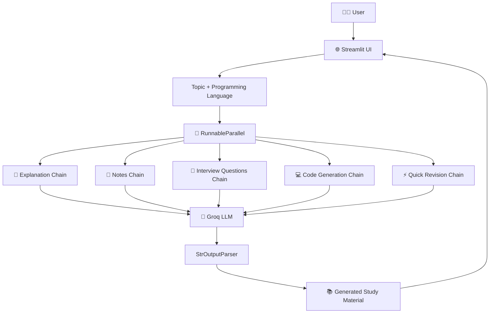

# 🤖 AI Study Assistant

An AI-powered study assistant built with **Python, LangChain, Groq, and Streamlit** that helps students learn technical topics, create revision notes, prepare interview questions, generate code, and quickly revise concepts.

The project demonstrates the practical use of **LangChain Chains, LCEL, Output Parsers, RunnableParallel, and Streamlit** to build a modular Generative AI application.

---

## 📌 Project Overview

Students often need different types of study material for the same technical topic:

* A simple explanation to understand the concept
* Concise notes for revision
* Interview questions for preparation
* Code implementation for programming topics
* Quick revision points before an exam/interview

Instead of generating each resource separately, this application takes a single topic and generates multiple study resources through a set of specialized LangChain chains.

### Example

**Input**

```text
Topic: Binary Search
Language: C++
```

**Output**

```text
📖 Explanation
📝 Short Notes
🎯 Interview Questions
💻 Code
⚡ Quick Revision
```

---

# 🎯 Key Features

### 📖 AI Explanation

Generates a beginner-friendly explanation of the requested topic with a simple example.

### 📝 Short Notes

Creates concise revision notes containing:

* Definition
* Important concepts
* Key points
* Important facts/formulas
* Complexity where applicable
* Examples

### 🎯 Interview Questions

Generates five technical interview questions with increasing difficulty:

```text
Basic → Intermediate → Slightly Challenging
```

### 💻 Code Generation

Generates a beginner-friendly implementation for the selected programming language.

Supported languages currently include:

```text
C++
Python
Java
JavaScript
C
```

### ⚡ Quick Revision

Produces a short collection of the most important points that can be reviewed quickly before an exam or interview.

### 🌐 Interactive Web Interface

The application uses Streamlit to provide a simple browser-based interface instead of requiring users to interact through the terminal.

---

# 🏗️ System Architecture

The application follows a modular chain-based architecture.



---

# 🔄 Application Workflow

The complete workflow is:

```text
                USER
                  │
                  ▼
        Enter Topic + Language
                  │
                  ▼
          Streamlit Interface
                  │
                  ▼
          RunnableParallel
                  │
        ┌─────────┼─────────┐
        │         │         │
        ▼         ▼         ▼
   Explanation  Notes   Interview
      Chain      Chain    Chain
        │         │         │
        └─────────┼─────────┘
                  │
        ┌─────────┴─────────┐
        ▼                   ▼
   Code Chain        Quick Revision
        │                   │
        └─────────┬─────────┘
                  ▼
             Final Results
                  │
                  ▼
            Streamlit UI
```

---

# 🔗 LangChain Architecture

Each individual feature follows the same basic chain structure:

```text
Input
  │
  ▼
ChatPromptTemplate
  │
  ▼
ChatGroq
  │
  ▼
StrOutputParser
  │
  ▼
Final Output
```

For example, the Explanation Chain:

```text
Topic
  │
  ▼
Explanation Prompt
  │
  ▼
Groq LLM
  │
  ▼
StrOutputParser
  │
  ▼
Explanation
```

---

# ⚡ RunnableParallel

The project uses `RunnableParallel` to execute multiple independent study-generation branches from the same input.

```text
                     Topic
                       │
                       ▼
              RunnableParallel
                       │
        ┌──────────────┼──────────────┐
        │              │              │
        ▼              ▼              ▼
   Explanation       Notes       Interview Qs
      Chain           Chain          Chain
        │              │              │
        └──────────────┼──────────────┘
                       │
              ┌────────┴────────┐
              ▼                 ▼
          Code Chain      Quick Revision
```

The final result is returned as a structured dictionary:

```python
{
    "explanation": "...",
    "notes": "...",
    "interview_questions": "...",
    "code": "...",
    "quick_revision": "..."
}
```

---

# 🧩 Project Structure

```text
AI-Study-Assistant/
│
├── venv/                  # Virtual environment (not committed)
│
├── .env                   # API credentials (not committed)
├── .gitignore
├── requirements.txt
│
├── app.py                 # Streamlit application
├── models.py              # Groq LLM configuration
├── prompts.py             # Prompt templates
├── chains.py              # LangChain chains and RunnableParallel
│
└── README.md
```

---

# 📂 File Responsibilities

## `models.py`

Responsible for configuring the Groq LLM.

```text
Environment Variables
        ↓
     ChatGroq
        ↓
       LLM
```

---

## `prompts.py`

Contains specialized prompts for:

```text
Explanation
Notes
Interview Questions
Quick Revision
Code Generation
```

This keeps prompt logic separate from application logic.

---

## `chains.py`

Contains the LangChain processing pipelines.

```text
Prompt → Model → Parser
```

and combines them using:

```text
RunnableParallel
```

---

## `app.py`

Responsible for the Streamlit interface.

It:

1. Accepts user input
2. Sends input to `study_chain`
3. Receives generated results
4. Displays the results in the browser

---

# 🛠️ Tech Stack

| Technology    | Purpose                         |
| ------------- | ------------------------------- |
| Python        | Core programming language       |
| LangChain     | LLM application framework       |
| Groq          | LLM inference/API               |
| Streamlit     | Web interface                   |
| python-dotenv | Environment variable management |
| Git           | Version control                 |
| GitHub        | Source code hosting             |

---

# 🧠 LangChain Concepts Demonstrated

This project was intentionally built using the concepts learned up to **Chains**.

### Core concepts used

* Chat Models
* Prompt Templates
* Prompt Variables
* LCEL
* Pipe Operator `|`
* Chains
* RunnableSequence behavior
* RunnableParallel
* `invoke()`
* Output Parsers
* `StrOutputParser`

---

# 🚫 Concepts Intentionally Not Used

This version intentionally does **not** use:

```text
❌ RAG
❌ Embeddings
❌ Vector Databases
❌ Retrievers
❌ Agents
❌ Tools
❌ LangGraph
❌ Memory
```

These concepts can be introduced in future versions as the project evolves.

---

# 🚀 Installation

## 1. Clone the repository

```bash
git clone https://github.com/YOUR_USERNAME/AI-Study-Assistant.git
```

```bash
cd AI-Study-Assistant
```

---

## 2. Create virtual environment

Windows:

```bash
python -m venv venv
```

Activate:

```bash
venv\Scripts\activate
```

---

## 3. Install dependencies

```bash
pip install -r requirements.txt
```

---

## 4. Configure environment variables

Create a `.env` file:

```env
GROQ_API_KEY=your_groq_api_key
```

Never commit the `.env` file to GitHub.

---

## 5. Run the application

```bash
streamlit run app.py
```

The application will open in your browser.

---

# 💡 Example Use Cases

### DSA Preparation

```text
Binary Search
Sliding Window
Two Pointer
Linked List
Stack
Queue
HashMap
Trees
Graphs
```

### Core CS Preparation

```text
DBMS
Operating Systems
Computer Networks
OOP
Computer Architecture
```

### Programming Practice

```text
Topic + Programming Language
        ↓
Concept
        ↓
Implementation
        ↓
Complexity
        ↓
Interview Questions
```

---

# 📊 Example

### Input

```text
Topic: Sliding Window
Language: C++
```

### AI-generated resources

```text
📖 Explanation
→ Understand the Sliding Window technique

📝 Notes
→ Important concepts and complexity

🎯 Interview Questions
→ 5 technical interview questions

💻 Code
→ C++ implementation/example

⚡ Quick Revision
→ Important points for last-minute revision
```

---

# 🔐 Environment & Security

API credentials are stored using environment variables.

The following files should never be committed:

```text
.env
venv/
__pycache__/
```

They are excluded through `.gitignore`.

---

# 📈 Development Journey

This project was developed incrementally while learning LangChain.

```text
Phase 0
Project Setup
     ↓
Phase 1
Groq + LangChain Model
     ↓
Phase 2
Explanation Chain
     ↓
Phase 3
Notes Chain
     ↓
Phase 4
Interview Questions Chain
     ↓
Phase 5
RunnableParallel
     ↓
Phase 6
Quick Revision Chain
     ↓
Phase 7
Code Generation Chain
     ↓
Phase 8
Streamlit UI
     ↓
AI Study Assistant v1
```

---

# 🧪 Future Improvements

The current version is intentionally limited to the concepts learned through LangChain Chains.

Future versions can progressively introduce more advanced Generative AI concepts.

## Version 2 — RAG Study Assistant

Possible features:

```text
Upload PDF / Notes
       ↓
Document Loading
       ↓
Chunking
       ↓
Embeddings
       ↓
Vector Database
       ↓
Retriever
       ↓
LLM
       ↓
Context-aware Answer
```

This would allow students to ask questions specifically from their own study material.

---

## Version 3 — Agentic Study Assistant

Introduce Agents and Tools:

```text
User Question
      ↓
    Agent
   /  |  \
Search Calculator Notes
   \  |  /
    Final Answer
```

The assistant could decide which tool is appropriate for a particular question.

---

## Version 4 — LangGraph Study Assistant

A future LangGraph version could introduce a multi-step study workflow:

```text
Question
   ↓
Understand
   ↓
Plan
   ↓
Retrieve / Use Tools
   ↓
Evaluate
   ↓
Generate Answer
   ↓
Create Revision Material
```

---

# 🎓 Learning Outcomes

By building this project, the following concepts were implemented practically:

* Building LLM-powered applications
* Working with Groq APIs
* Managing API keys securely
* Creating reusable prompt templates
* Building LangChain chains
* Using LCEL syntax
* Connecting prompts, models and parsers
* Creating parallel processing branches
* Designing modular AI application architecture
* Building a Streamlit frontend
* Managing a project with Git and GitHub

---

# ⭐ Project Status

**Status: ✅ Completed — Version 1**

The current version demonstrates a complete **Chains-based Generative AI application**.

```text
          🤖 AI STUDY ASSISTANT v1

              User Input
                  │
                  ▼
            Streamlit UI
                  │
                  ▼
          RunnableParallel
                  │
      ┌───────────┼───────────┐
      ▼           ▼           ▼
 Explanation    Notes     Interview Qs
      │           │           │
      └───────────┼───────────┘
                  │
          ┌───────┴───────┐
          ▼               ▼
        Code        Quick Revision
          │               │
          └───────┬───────┘
                  ▼
            Study Material
```

---

## 👨‍💻 Author

**Rehan Ahmed**

Built as a hands-on Generative AI learning project while progressing through LangChain concepts.

---

## 📄 License

This project is intended for educational and learning purposes.


User
 │
 ├── Topic
 └── Programming Language
          │
          ▼
   ┌──────────────────────┐
   │     Streamlit UI     │
   └──────────┬───────────┘
              │
              ▼
      ┌─────────────────┐
      │  Study Chain    │
      │ RunnableParallel│
      └────────┬────────┘
               │
      ┌────────┼───────────────┬─────────────┐
      ▼        ▼               ▼             ▼
 Explanation  Notes      Interview Qs      Code
      │        │               │             │
      └────────┴───────────────┴─────────────┘
                       │
                       ▼
                Quick Revision
                       │
                       ▼
                  Final Results